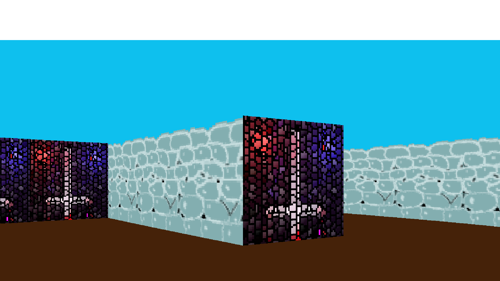
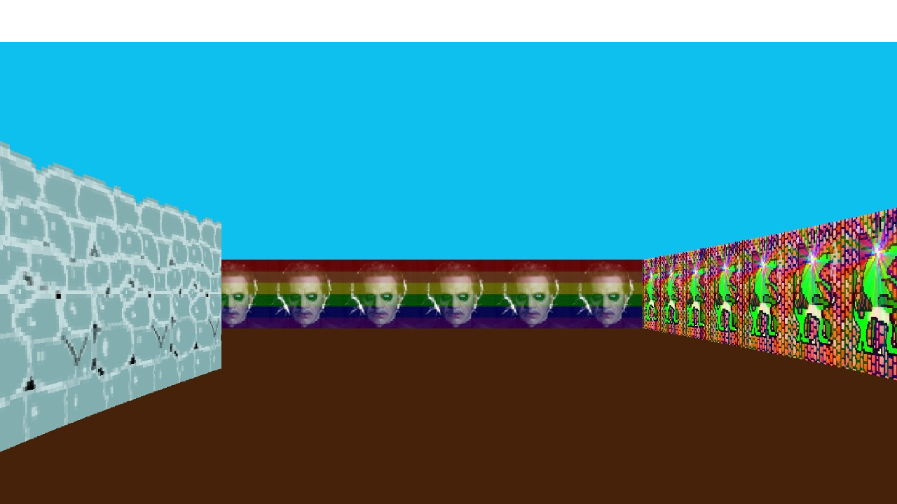

# Wolf3D
```
42 school raycasting project that renders a basic map file and is inspired by Wolfenstein3D

No librairies were allowed except one for handling the window (we used SDL2) 
```



### Usage
```
./wolf3d or ./wolf3d input_file to override textures and map with your own
```
### Keyboard inputs
```
Move vision: move mouse
Move player: AWSD
Turn player: LEFT or RIGHT ARROWS
Crouch: C
"Fly": F

Quit: press ESC
```
